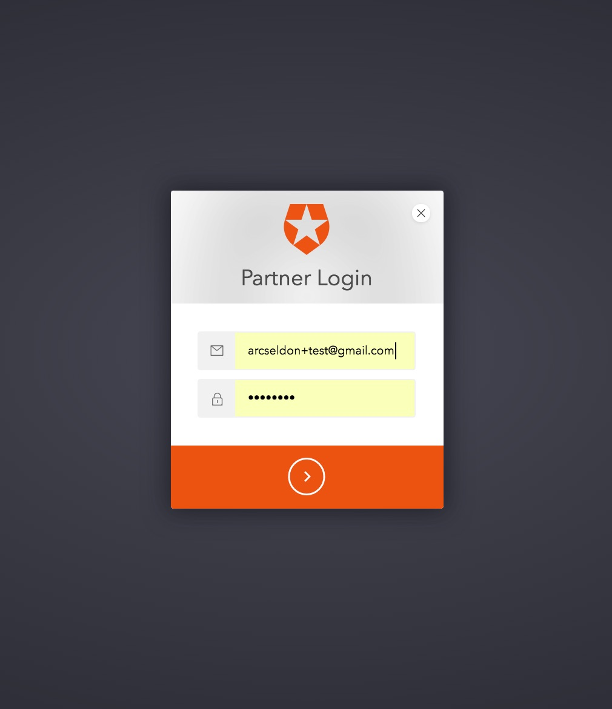
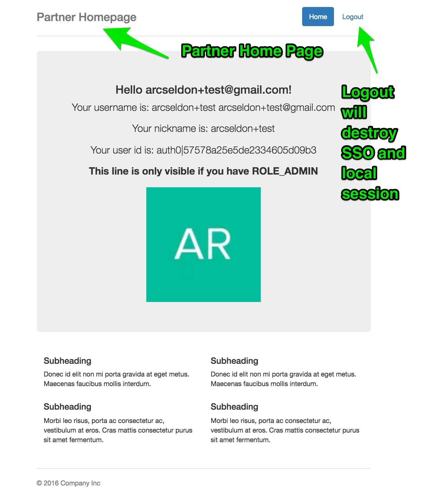

## Sample application demonstrating Auth0 and spring security integration for a Java Spring MVC application enabled with Single Sign-On

This is a companion sample for the [Auth0 Spring Security MVC](https://github.com/auth0/auth0-spring-security-mvc) library.
Please refer to that library and documentation for further information specific to the library itself.

This sample application shows you how to:

 1. Configure and run Java based Spring application with Auth0 (Lock or Auth0.js) and Spring Security
 2. 100% Java Configuration (Annotations)
 3. Secure one or more URL endpoints with Role / Authority based permissions (ROLE_USER, ROLE_ADMIN etc)
 4. Secure Java Services using method level security annotations for role based access control (optional)
 5. Use Spring Security JSTL tag library to add role level security to your JSP pages.
 6. Participate in an Auth0 authentication Single Sign-On (SSO) session for SSO between two web sites.

 Note this application is the `Partner Site` - it co-operates with the Portal Site
 in order to participate in SSO. The Portal Site must be running in order to login and create an SSO Session.

Let's get started - it only takes a few minutes to have a working application with all the above.

### Prerequisites

In order to run this example you will need to have Java 7+ and Maven installed.

Check that your maven version is 3.0.x or above:

```sh
mvn -v
```

### Setup

Create an [Auth0 Account](https://auth0.com) (if not already done so - free!).


#### From the Auth0 Dashboard

Create an application - for the purposes of this sample - `app2`

This is a separate `app` to `app1` created for the Portal site.

Ensure you add the following to the settings.

Allowed Callback URL:

```
http://localhost:4000/callback
```

Ensure you add the following to the settings.

Allowed Logout URLs:

```
http://localhost:4000/logout
```

Associate this application with the same username-password) DB `connection` you created
when setting up the Portal site.


###### Add Role Based Authorization By Creating an Auth0 Rule

Ensure you set up the Auth0 Rule for Authorization as described in the README when creating the Portal site.


### Inside the Application - update configuration information

Enter your:

`client_id`, `client_secret`, and `domain` information into `src/main/resources/auth0.properties`

Also enter your:

`connection` information (this is the name of your DB connection) into `src/main/resources/sso.properties`

For all other settings defined in `auth0.properties` please refer to the [library readme](https://github.com/auth0/auth0-spring-security-mvc#auth0configuration)

`auth0.defaultAuth0WebSecurityEnabled: false` - this ensures we do not autowire the default configuration file
provided with the `auth0-spring-security-mvc` library itself. That is a default configuration suitable only for
simpler applications seeking to have an out of the box secured endpoint URL - similar to `auth-servlet` library.


### Build and Run

In order to build and run the project execute:

```sh
mvn spring-boot:run
```

Then, go to [http://localhost:4000/partner/home](http://localhost:4000/partner/home).

---

### Screenshots of the overall flow (minus growler notifications):


#### 1.Login



#### 2. Home - logged in user has ROLE_ADMIN level authority




---


## License

The MIT License (MIT)

Copyright (c) 2013 AUTH10 LLC

Permission is hereby granted, free of charge, to any person obtaining a copy
of this software and associated documentation files (the "Software"), to deal
in the Software without restriction, including without limitation the rights
to use, copy, modify, merge, publish, distribute, sublicense, and/or sell
copies of the Software, and to permit persons to whom the Software is
furnished to do so, subject to the following conditions:

The above copyright notice and this permission notice shall be included in
all copies or substantial portions of the Software.

THE SOFTWARE IS PROVIDED "AS IS", WITHOUT WARRANTY OF ANY KIND, EXPRESS OR
IMPLIED, INCLUDING BUT NOT LIMITED TO THE WARRANTIES OF MERCHANTABILITY,
FITNESS FOR A PARTICULAR PURPOSE AND NONINFRINGEMENT. IN NO EVENT SHALL THE
AUTHORS OR COPYRIGHT HOLDERS BE LIABLE FOR ANY CLAIM, DAMAGES OR OTHER
LIABILITY, WHETHER IN AN ACTION OF CONTRACT, TORT OR OTHERWISE, ARISING FROM,
OUT OF OR IN CONNECTION WITH THE SOFTWARE OR THE USE OR OTHER DEALINGS IN
THE SOFTWARE.
